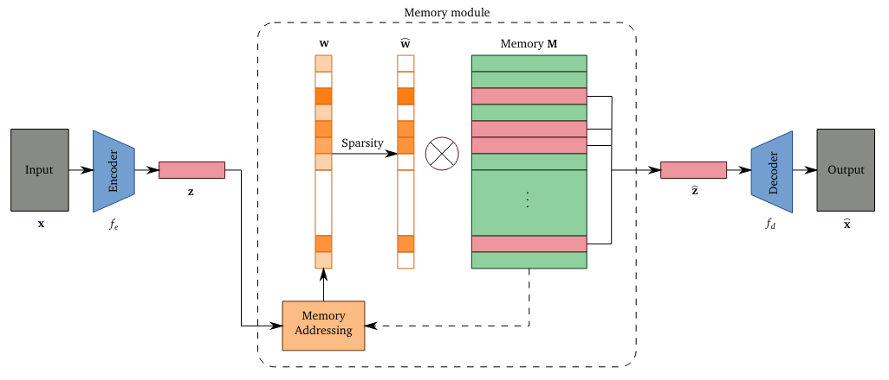
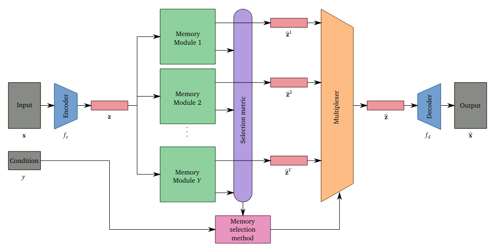

<div align="center">

# Memory Augmented Conditional Autoencoder for Anomaly Detection

<a href="https://pytorch.org/get-started/locally/"></a>
<a href="https://pytorchlightning.ai/"></a>
<a href="https://hydra.cc/"></a>
[](https://github.com/psf/black)

</div>

## Description
This is the code accompanying my [Bachelors's Thesis](https://www.leonzamel.com/files/bachelors_thesis.pdf).

It builds upon [memae-anomaly-detection](https://github.com/donggong1/memae-anomaly-detection), a memory-augmented autoencoder for anomaly detection, but extends the system by using multiple memories that can be addressed individually, either explicitly by providing a condition or having the memory "self-select" via some metric. This allows reusage of the encoder and decoder parts of the autoencoder between conditions, enables few-shot-learning using multiple different memory-initialization strategies, and more.

This repository also includes analysis, model modifications, additional experiments and some code specific improvements over the original paper/implementation.
The code uses PyTorch Lightning for improved code structure and Hydra for config management.

Original MemAE Structure (adapted from Gong et al.):


C-MemAE Structure (ours):


## How to run
Install dependencies:
```yaml
# clone project
git clone https://github.com/LeonZamel/BT
cd BT

# [OPTIONAL] create conda environment

# install requirements
pip install -r requirements.txt
```

Train a model:

Select a dataset (mnist or cifar) and model type (memae or ae), you can also pass additional parameters as found in the hydra config files (e.g. entropy_loss_weight, shrink_threshold, cosine_similarity, ...)
```yaml
# default
python main.py model=memae datamodule=mnist
```
<br>

[Template used](https://github.com/ashleve/lightning-hydra-template)
